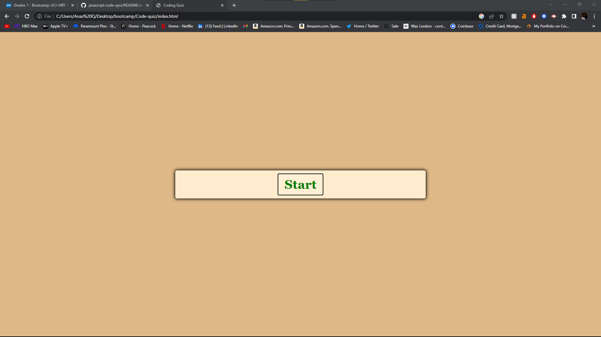
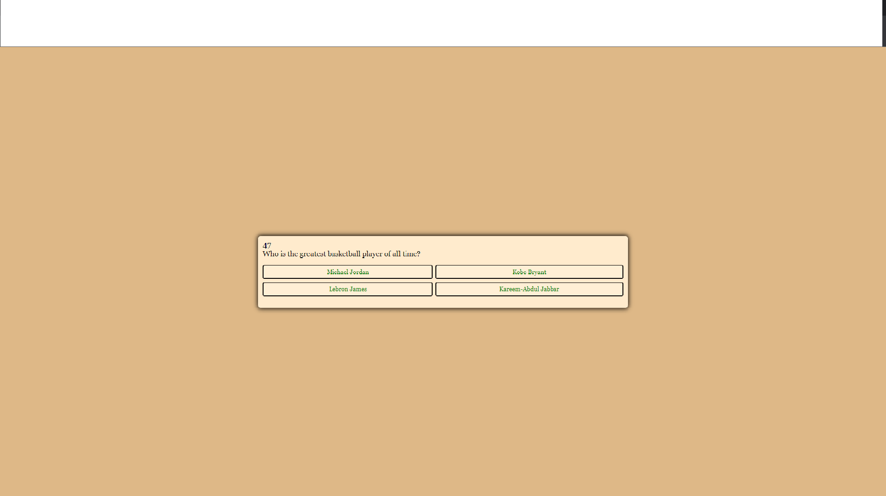
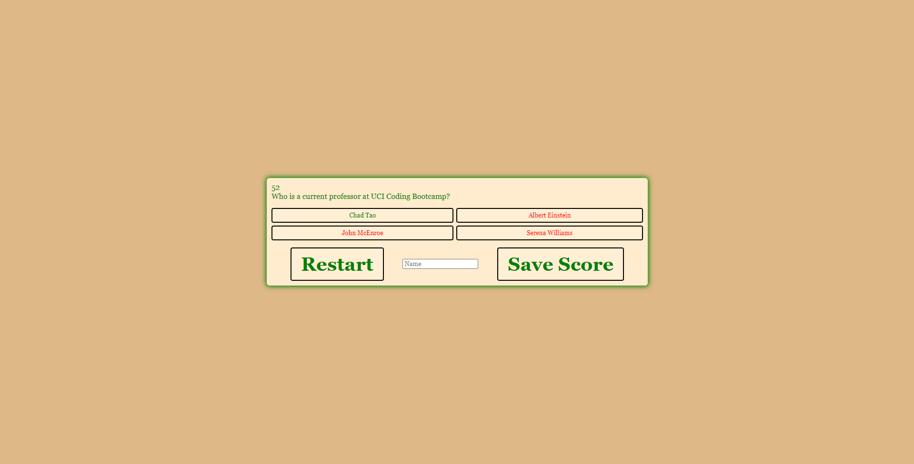

# JavaScript Code Quiz!

This web application challenges the user by prompting you with a random code quiz. Once launched, click the "Start Quiz" button to get started going through all of the questions. You will have 60 seconds to complete the quiz.

## About Quiz

- **Each question is randomly arranged**
- **Each answer choice is randomly arranged**
- **Once you input your name at the end of the quiz, it is saved in your local data**

To get started, click on the link below that should prompt the site to look like this:

After you start the quiz, you should be prompted with a question window that looks like this:

After you complete the quiz, you will be asked to submit your Name to save your score results locally. You will be prompted with this window:

Happy quizing!
